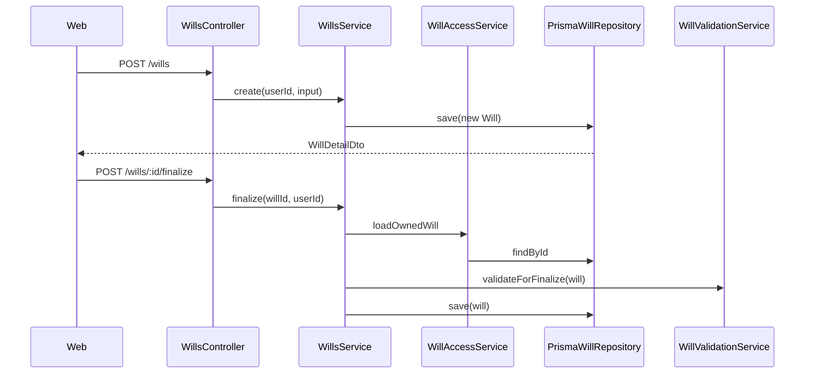
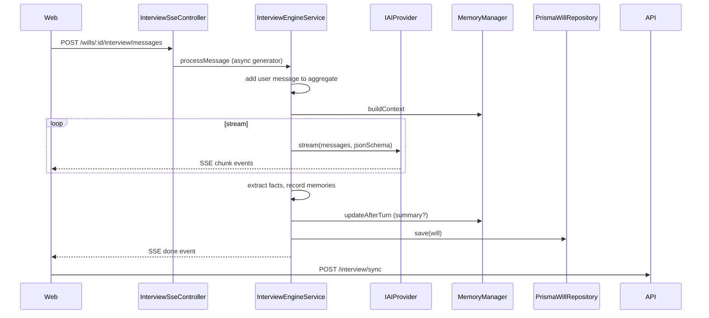
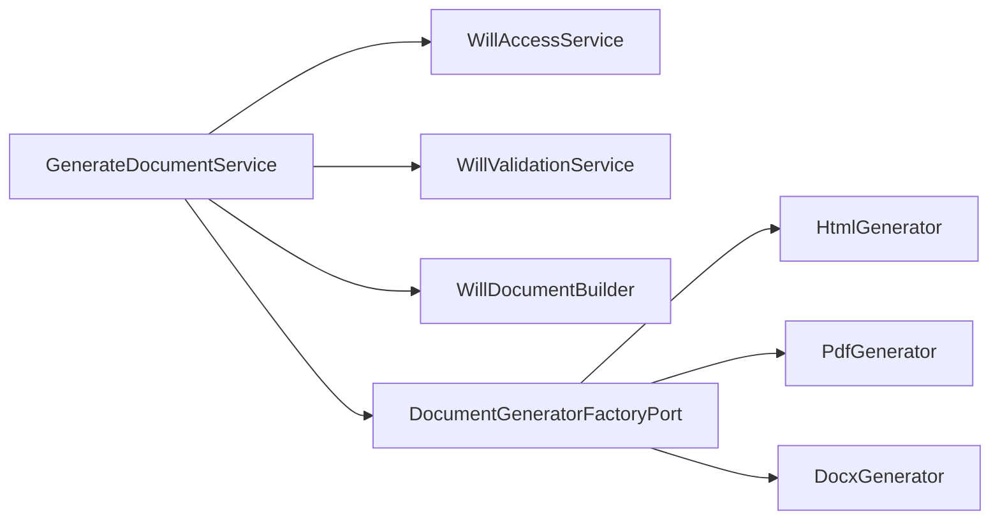

# AI Will Maker — Production Architecture

> **Status:** Implemented (v1)  
> **Stack:** NestJS · Next.js 15 · PostgreSQL · Prisma · Docker Compose  
> **Companion docs:** [DECISIONS.md](./DECISIONS.md) · [INCIDENT.md](./INCIDENT.md) · [ARCHITECTURE.md](./ARCHITECTURE.md) (original design draft)

---

## 1. System context

```
┌─────────────┐     HTTPS/JWT      ┌─────────────┐     Prisma      ┌──────────────┐
│  Next.js    │ ◄────────────────► │  NestJS API │ ◄──────────────►│  PostgreSQL  │
│  apps/web   │   REST + SSE       │  apps/api   │                 │              │
└─────────────┘                    └──────┬──────┘                 └──────────────┘
                                          │
                                          │ HTTPS (streaming)
                                          ▼
                                   ┌─────────────┐
                                   │ OpenAI /    │
                                   │ Claude      │
                                   └─────────────┘
```

**Bounded contexts (implemented):**

| Context | Entry points | Core types |
|---------|--------------|------------|
| Identity | `/auth/*` | `User`, JWT, refresh tokens |
| Will drafting | `/wills/*` | `Will` aggregate |
| AI interview | `/wills/:id/interview/*` | `Conversation`, memories |
| Validation | `/wills/:id/validation` | `ValidationEngine`, specs |
| Documents | `/wills/:id/document` | `WillDocument`, generators |

---

## 2. Layered architecture

```
┌────────────────────────────────────────────────────────────────────────┐
│ PRESENTATION (apps/api/src/presentation)                               │
│ Controllers, DTOs, Guards, SSE                                         │
└───────────────────────────────┬────────────────────────────────────────┘
                                │
┌───────────────────────────────▼────────────────────────────────────────┐
│ APPLICATION (apps/api/src/application)                                 │
│ WillsService · InterviewEngineService · ValidationService · AuthService│
│ WillAccessService · Ports (interfaces)                                 │
└───────────────────────────────┬────────────────────────────────────────┘
                                │ depends on
┌───────────────────────────────▼────────────────────────────────────────┐
│ DOMAIN (packages/will-domain + packages/shared-kernel)                 │
│ Will · Beneficiary · ValidationSpecification · Repository ports        │
└───────────────────────────────┬────────────────────────────────────────┘
                                │ implemented by
┌───────────────────────────────▼────────────────────────────────────────┐
│ INFRASTRUCTURE (apps/api/src/infrastructure)                           │
│ Prisma repositories · OpenAI/Claude · PDF/HTML · Memory strategies     │
└────────────────────────────────────────────────────────────────────────┘
```

**Dependency rule:** arrows point inward. Application never imports concrete infrastructure (post-refactor: document factory uses port + DI token).

---

## 3. Monorepo layout

```
ai-will-maker/
├── packages/
│   ├── shared-kernel/          # Result<T,E>, branded IDs, DomainError
│   └── will-domain/            # Aggregates, VOs, validation, ports
├── apps/
│   ├── api/                    # NestJS backend (port 4000)
│   └── web/                    # Next.js frontend (port 3000)
├── docs/
│   ├── Architecture.md         # This file
│   ├── DECISIONS.md
│   ├── INCIDENT.md
│   └── …
└── docker-compose.yml
```

---

## 4. Domain model

### 4.1 Will aggregate

`Will` is the aggregate root. It owns:

- Beneficiaries, Assets, AssetAllocations, ResiduaryAllocations
- Executors, Guardians, Witnesses
- Conversations (messages + memories + summary)
- Status lifecycle: `DRAFT` → `IN_REVIEW` → `FINALIZED`

Key methods:

| Method | Purpose |
|--------|---------|
| `belongsTo(userId)` | Ownership check (authorization) |
| `submitForReview(validator)` | Status transition + validation profile `review` |
| `finalize(validator)` | Status transition + validation profile `finalize` |
| `startConversation` / `addConversationMessage` / `recordMemory` | Interview |
| `applyMemoriesToDraft(mapper)` | Sync extracted facts → draft entities |

### 4.2 Value objects

`Email`, `Jurisdiction`, `Money`, `SharePct`, `MemoryFact` — constructed via factories returning `Result`.

### 4.3 Validation (Specification pattern)

```
WillValidationService
  └── ValidationEngine
        └── ValidationSpecification[]  (9 specs)
              appliesTo(profile) → isSatisfiedBy(will) → getIssues(will)
```

Profiles: `review` (allows completion gaps) · `finalize` (strict).

---

## 5. API modules

| NestJS Module | Controllers | Application services |
|---------------|-------------|----------------------|
| `AuthModule` | `AuthController` | `AuthService` |
| `UsersModule` | — | `UsersService` |
| `WillsModule` (@Global) | `WillsController`, `ValidationController` | `WillsService`, `ValidationService`, `WillAccessService` |
| `InterviewModule` | `InterviewController`, `InterviewSseController` | `InterviewEngineService` |
| `DocumentsModule` | `DocumentsController` | `GenerateDocumentService` |
| `PersistenceModule` | — | Prisma + repositories |

### 5.1 DI tokens (`common/tokens.ts`)

| Token | Implementation |
|-------|----------------|
| `WILL_REPOSITORY` | `PrismaWillRepository` |
| `USER_REPOSITORY` | `PrismaUserRepository` |
| `WILL_VALIDATION_SERVICE` | `WillValidationService` |
| `DOCUMENT_GENERATOR_FACTORY` | `DocumentGeneratorFactory` |
| `AI_PROVIDER` | `AiProviderFactory.create()` |
| `MEMORY_MANAGER` | `MemoryManagerFactory.create()` |
| `EXTRACTION_STRATEGIES` | Structured + Correction strategies |

---

## 6. Request flows

### 6.1 Will lifecycle



### 6.2 AI interview (SSE)



### 6.3 Document generation



---

## 7. Persistence

### 7.1 Schema highlights

- `wills` — aggregate root, `revision` for optimistic locking
- Child tables: `beneficiaries`, `assets`, `executors`, …
- `conversations`, `conversation_messages`, `conversation_memories`
- `conversation_memory_snapshots` — hybrid/rolling memory audit
- **Planned, unused:** `will_versions`, `audit_logs`

### 7.2 Repository pattern

| Port | Adapter |
|------|---------|
| `WillRepository` | `PrismaWillRepository` |
| `UserRepository` | `PrismaUserRepository` |
| `ConversationRepository` | `PrismaConversationRepository` (wired, unused) |
| `MemorySnapshotRepository` | `PostgresMemorySnapshotRepository` |
| `RefreshTokenRepository` | `PostgresRefreshTokenRepository` |

`save(will)` loads full graph, upserts children, bumps `revision`. On conflict → `CONCURRENCY_CONFLICT` domain error → HTTP 409.

---

## 8. AI & memory subsystem

### 8.1 Provider adapter

`IAIProvider.stream({ messages, jsonSchema, temperature })` — implemented by `OpenAiProvider`, `ClaudeProvider`. Selected via `AI_PROVIDER` env.

### 8.2 Memory strategies

| Strategy | Behavior | Cost |
|----------|----------|------|
| `full` | All messages in context | Highest tokens |
| `rolling` | Summary + recent window | Medium |
| `hybrid` (default) | Facts + summary + window | Medium; may refresh summary |

Config: `MEMORY_STRATEGY`, token thresholds in `memory-config.ts`.

### 8.3 Extraction

`ExtractionStrategyRouter` picks structured JSON extraction vs correction flow based on `IntentClassifier`.

---

## 9. Frontend architecture

### 9.1 Structure

```
apps/web/src/
├── features/
│   ├── auth/           # login, register hooks
│   ├── will-builder/   # dashboard, create, detail, submit/finalize
│   ├── chat/           # SSE interview
│   ├── preview/        # HTML preview
│   └── validation/     # validation report
└── shared/
    ├── api/            # ApiClient, HttpTransport, SSE
    ├── lib/            # query-keys, invalidateWillWorkspace
    └── providers/      # ApiClientProvider
```

### 9.2 Data flow

- **TanStack Query** for server state (`queryKeys.wills`, `interview.status`, etc.)
- **Mutations** call `invalidateWillWorkspace()` after will-changing operations
- **HttpTransport** centralizes Bearer token + 401 refresh retry
- **SSE** (`sse-transport.ts`) separate from HttpTransport (streaming body)

### 9.3 Routes

| Route | Feature |
|-------|---------|
| `/dashboard` | Will list |
| `/wills/new` | Create will |
| `/wills/[id]/chat` | AI interview |
| `/wills/[id]/builder` | Manual edit + lifecycle |
| `/wills/[id]/preview` | Document preview |
| `/wills/[id]/validation` | Validation report |

---

## 10. Cross-cutting concerns

| Concern | Implementation |
|---------|----------------|
| Auth | JWT guard + `@CurrentUser()` decorator |
| Errors | `DomainExceptionFilter` maps `DomainError` → HTTP |
| CORS | `WEB_ORIGIN` in `main.ts` |
| Config | `@nestjs/config`, `.env` per app |

---

## 11. Deployment

```yaml
# docker-compose.yml
services:
  postgres:   # 5432
  api:        # 4000, depends on postgres
  web:        # 3000, NEXT_PUBLIC_API_URL → api
```

Build order: `shared-kernel` → `will-domain` (`tsc --build`) → `api` → `web`.

---

## 12. Design review summary

### Strengths
- Clear layer boundaries and repository ports
- Rich `Will` aggregate with explicit lifecycle
- Specification-based validation (extensible per jurisdiction)
- Swappable AI, memory, document, extraction strategies
- Post-review: centralized ownership, DI for validation, document factory port

### Risks (see INCIDENT.md)
- No automated tests
- AI cost exposure without rate limits
- Heavy `save()` per interview turn
- Audit/version tables not populated
- `InterviewEngineService` concentration of responsibilities

### Recommended next steps (priority order)
1. API + domain test suite (validation specs, auth, finalize gate)
2. Per-user interview rate limits + `MEMORY_STRATEGY=rolling` in prod
3. `will_versions` snapshot on finalize
4. Split conversation persistence from full will save
5. 409 retry UX on web

---

## 13. Environment variables

| Variable | App | Purpose |
|----------|-----|---------|
| `DATABASE_URL` | api | Postgres connection |
| `JWT_SECRET` | api | Token signing |
| `AI_PROVIDER` | api | `openai` \| `claude` |
| `OPENAI_API_KEY` / `ANTHROPIC_API_KEY` | api | Provider credentials |
| `MEMORY_STRATEGY` | api | `full` \| `rolling` \| `hybrid` |
| `WEB_ORIGIN` | api | CORS allowlist |
| `NEXT_PUBLIC_API_URL` | web | API base URL |

---

## 14. Glossary

| Term | Meaning |
|------|---------|
| Aggregate root | `Will` — consistency boundary |
| Port | Interface defined by domain/application |
| Adapter | Infrastructure implementation of a port |
| Specification | Single validation rule object |
| SSE | Server-Sent Events for AI streaming |
