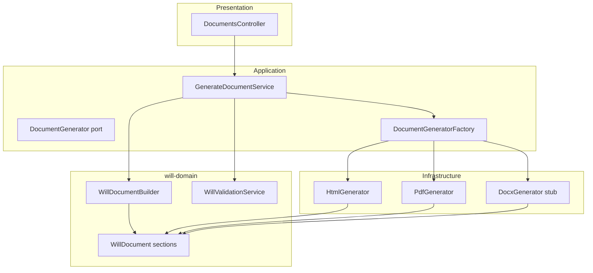

# Document Generation Subsystem

Generates exportable will documents from finalized domain state using the **Factory Pattern**. Business logic (section building, validation gates) is format-agnostic; only infrastructure adapters change per output format.

## Architecture



## Layers

| Layer | Responsibility |
|-------|----------------|
| **Domain** | `WillDocument`, `WillDocumentBuilder` — sections from `Will` / `WillSnapshot` entities |
| **Application** | `GenerateDocumentService` — load will, enforce validation, build document, delegate to factory |
| **Infrastructure** | `HtmlGenerator`, `PdfGenerator`, `DocxGenerator` — render `WillDocument` to bytes |
| **Factory** | `DocumentGeneratorFactory` — selects generator by `format` or `DOCUMENT_FORMAT` env |

## Validation gate

Documents are generated **only when**:

1. Will exists and belongs to the requesting user
2. Will status is `FINALIZED`
3. `WillValidationService.validateForFinalize()` returns `isValid: true`

If validation fails, the API returns `422` with `completionIssues`, `errors`, and `warnings`.

## Will sections (from domain entities)

`WillDocumentBuilder` produces seven ordered sections:

| Section ID | Title | Source entities |
|------------|-------|-----------------|
| `declaration` | Declaration | testator name, jurisdiction |
| `beneficiaries` | Beneficiaries | `Beneficiary` |
| `specific-bequests` | Specific Bequests | `Asset` + `AssetAllocation` |
| `residuary` | Residuary Estate | `ResiduaryAllocation` |
| `executors` | Appointment of Executor | `Executor` |
| `guardians` | Guardianship | `Guardian` + ward `Beneficiary` |
| `witnesses` | Attestation and Witnesses | `Witness` |

## DocumentGenerator interface

```typescript
interface DocumentGenerator {
  readonly format: DocumentFormat; // 'html' | 'pdf' | 'docx'
  generate(document: WillDocument): Promise<GeneratedDocument>;
}
```

## Implementations

| Class | Format | MIME type |
|-------|--------|-----------|
| `HtmlGenerator` | `html` | `text/html` |
| `PdfGenerator` | `pdf` | `application/pdf` |
| `DocxGenerator` | `docx` | stub — `NotImplementedException` |

## Factory (Open/Closed)

```typescript
// document-generator.factory.ts
this.generators = new Map([
  ['html', htmlGenerator],
  ['pdf', pdfGenerator],
  ['docx', docxGenerator],
]);
```

**Adding DOCX later:** implement `DocxGenerator.generate()` using a library (e.g. `docx`) reading `WillDocument.sections`. No changes to `GenerateDocumentService`, `WillDocumentBuilder`, or validation logic.

## API

```
GET /wills/:willId/document?format=pdf|html|docx
Authorization: Bearer <token>
```

Default format: `DOCUMENT_FORMAT` env var (default `pdf`).

## Configuration

```env
DOCUMENT_FORMAT=pdf
```

## File map

```
packages/will-domain/src/documents/
  will-document.vo.ts
  will-document.builder.ts

apps/api/src/application/documents/
  ports/document-generator.port.ts
  generate-document.service.ts

apps/api/src/infrastructure/documents/
  document-generator.factory.ts
  document-html.renderer.ts
  html.generator.ts
  pdf.generator.ts
  docx.generator.ts

apps/api/src/modules/documents.module.ts
apps/api/src/presentation/documents/documents.controller.ts
```

## Dependency injection

```typescript
// documents.module.ts
providers: [
  GenerateDocumentService,
  HtmlGenerator,
  PdfGenerator,
  DocxGenerator,
  DocumentGeneratorFactory,
]
```

`GenerateDocumentService` depends on `WillRepository` (interface) and `DocumentGeneratorFactory` — never on `PdfGenerator` or Prisma directly.
