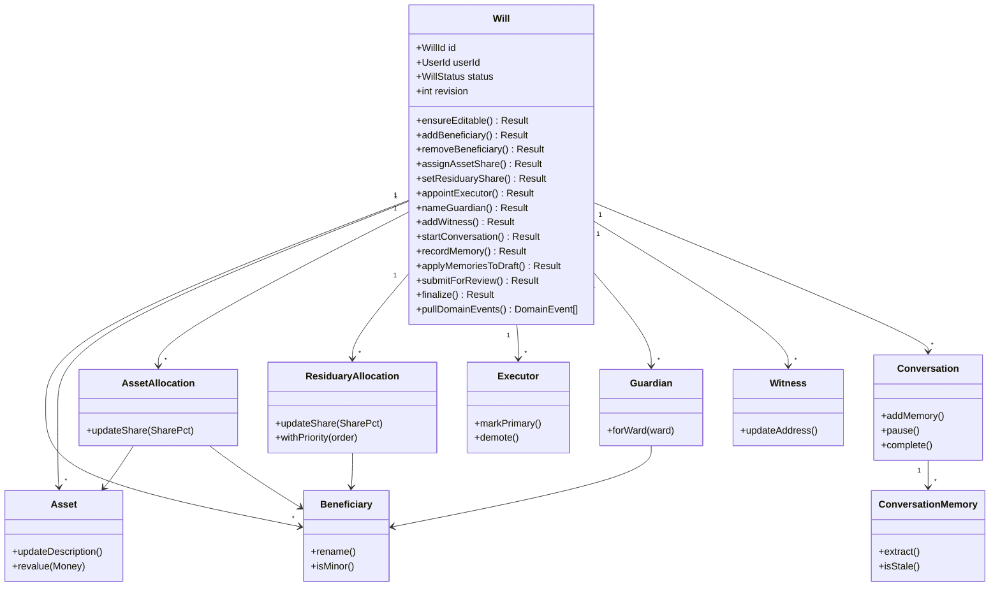
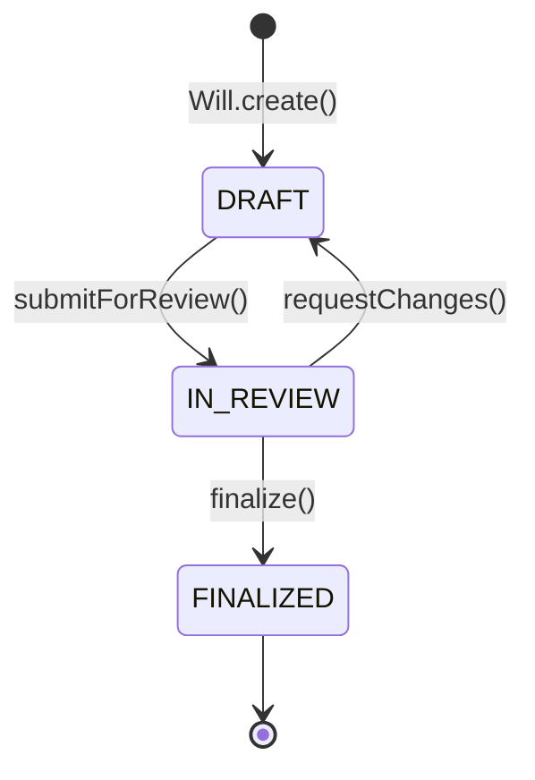

# Domain Model — AI Assisted Will Maker

Rich domain model for `packages/will-domain`. See [DOMAIN_MODEL_ERD.md](./DOMAIN_MODEL_ERD.md) for the physical ERD and invariant table.

---

## Aggregates

### Will (root)

Legal drafting aggregate. All child entities are created and mutated through `Will` behavior methods.



### User (separate aggregate)

Identity context. Owns wills by reference (`userId`) only.

```typescript
User.register(props, hasher, plainPassword): Promise<Result<User, DomainError>>
User.verifyPassword(plain, hasher): Promise<boolean>
```

---

## Status Machine



---

## Value Objects

| VO | Location | Rules |
|----|----------|-------|
| `SharePct` | `value-objects/share-pct.vo.ts` | 0.01–100.00, 2 decimal places |
| `Money` | `value-objects/money.vo.ts` | Non-negative, ISO 4217 currency |
| `Email` | `value-objects/email.vo.ts` | Normalized lowercase |
| `Jurisdiction` | `value-objects/jurisdiction.vo.ts` | Must be in supported registry |
| `MemoryFact` | `value-objects/memory-fact.vo.ts` | key, value, confidence 0–1 |
| `WillSnapshot` | `value-objects/will-snapshot.vo.ts` | Immutable finalize output |

---

## Domain Services

### WillValidationService

```typescript
validateForReview(will: Will): ValidationResult
validateForFinalize(will: Will): ValidationResult
```

### ConversationMemoryMapper

Maps `ConversationMemory` facts (keys like `beneficiary.*`, `asset.*`, `executor.*`) into `Will` mutations via `applyMemoriesToDraft()`.

---

## Repository Ports

| Port | File | Responsibility |
|------|------|----------------|
| `IWillRepository` | `ports/will.repository.port.ts` | Load/save full Will graph |
| `IUserRepository` | `ports/user.repository.port.ts` | User identity persistence |
| `IWillVersionRepository` | `ports/will-version.repository.port.ts` | Append-only version snapshots (future) |
| `IAuditLogRepository` | `ports/audit-log.repository.port.ts` | Append-only audit trail (future) |
| `IUnitOfWork` | `ports/unit-of-work.port.ts` | Transactional boundary |

```typescript
interface IWillRepository {
  findById(id: WillId, options?: { includeConversation?: boolean }): Promise<Will | null>
  findByUserId(userId: UserId): Promise<WillSummary[]>
  save(will: Will): Promise<void>
  delete(id: WillId): Promise<void>
  exists(id: WillId): Promise<boolean>
}
```

No `IConversationRepository` — conversation persists through `IWillRepository.save(will)`.

---

## Domain Events

| Event | Trigger |
|-------|---------|
| `WillCreated` | `Will.create()` |
| `BeneficiaryRemoved` | `Will.removeBeneficiary()` |
| `WillStatusChanged` | Status transitions |
| `WillFinalized` | `Will.finalize()` |

Collected via `will.pullDomainEvents()` for future `IAuditLogRepository` projection.

---

## Package Structure

```
packages/
├── shared-kernel/          # Result, branded IDs, DomainError
└── will-domain/
    ├── entities/           # Will (root) + 10 child entities
    ├── value-objects/
    ├── services/
    ├── ports/
    └── events/
```

---

## Prisma Schema

Full schema: [apps/api/src/infrastructure/persistence/prisma/schema.prisma](../apps/api/src/infrastructure/persistence/prisma/schema.prisma)

Key constraints:

- `asset_allocations`: `@@unique([assetId, beneficiaryId])`, CASCADE deletes
- `residuary_allocations`: `@@unique([willId, beneficiaryId])`, CASCADE deletes
- `guardians`: `@@unique([willId, wardBeneficiaryId])`
- `witnesses`: `@@unique([willId, witnessOrder])`
- `conversation_memories`: `@@unique([conversationId, factKey])`
- `will_versions`: `@@unique([willId, versionNumber])` (future)
- `wills.revision`: optimistic locking column

---

*Document version: 2.0*
