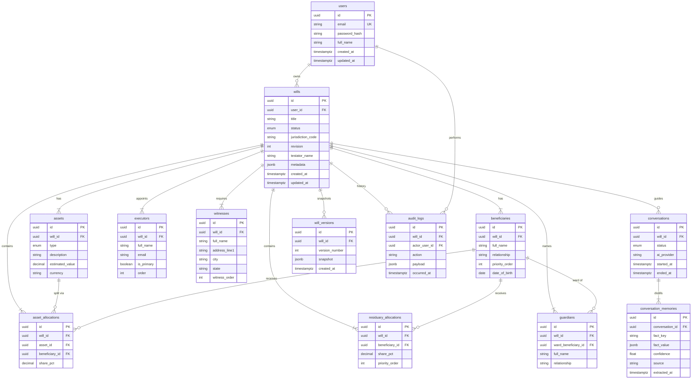
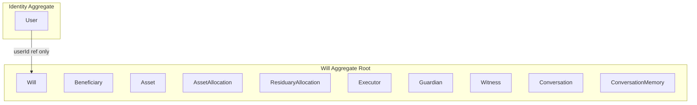

# Domain Model ERD — AI Assisted Will Maker

Physical data model aligned with [packages/will-domain](../packages/will-domain) and [schema.prisma](../apps/api/src/infrastructure/persistence/prisma/schema.prisma).

---

## Entity Relationship Diagram

---

## Aggregate Boundaries

### Why Will is the aggregate root

| Criterion | Explanation |
|-----------|-------------|
| Transactional consistency | Removing a beneficiary must atomically remove its asset and residuary allocations and guardians. Only the root coordinates this. |
| Cross-entity invariants | Asset share sums, residuary totals, and executor primary designation span multiple entities. |
| Lifecycle coupling | Executors, guardians, witnesses, and allocations have no meaning outside a specific will. |
| Draft gating | `WillStatus` controls mutability for all children via `ensureEditable()`. |

### Why User is separate

- Independent lifecycle (account exists before any will).
- Password changes do not affect will legal content.
- Referenced by `will.userId` only.

### Conversation ownership (hybrid)

`Conversation` and `ConversationMemory` are **compositionally owned** by `Will`:

- FK `will_id` with `ON DELETE CASCADE`.
- Mutations via `Will.startConversation()` and `Will.recordMemory()`.
- Persisted through `IWillRepository.save(will)` — no separate conversation repository.
- **Lazy-loaded** by default (`includeConversation: false`) to avoid loading AI history on every will read.

---

## Orphan Prevention

| Mechanism | Layer |
|-----------|-------|
| `asset_allocations` CASCADE on `assets` and `beneficiaries` delete | Database |
| `residuary_allocations` CASCADE on `beneficiaries` delete | Database |
| `guardians` CASCADE on `ward_beneficiary_id` delete | Database |
| `@@unique([assetId, beneficiaryId])` | Database |
| `@@unique([willId, beneficiaryId])` on residuary | Database |
| `Will.removeBeneficiary()` cascades allocations + guardians | Domain |
| `Will.removeAsset()` cascades asset allocations | Domain |
| `Will.assignAssetShare()` validates same `willId` | Domain |

---

## Invariants

| ID | Rule | Enforced by |
|----|------|-------------|
| INV-01 | Mutations blocked when `status = FINALIZED` | `Will.ensureEditable()` |
| INV-02 | Asset allocation refs belong to same will | `Will.assignAssetShare()` |
| INV-03 | Asset share sum per asset ≤ 100% | `Will.validateAssetShares()` |
| INV-04 | Residuary sum = 100% at finalize | `WillValidationService` |
| INV-05 | Remove beneficiary cascades allocations + guardians | `Will.removeBeneficiary()` |
| INV-06 | Remove asset cascades asset allocations | `Will.removeAsset()` |
| INV-07 | Exactly one primary executor at finalize | `WillValidationService` |
| INV-08 | ≥2 witnesses at finalize | `WillValidationService` |
| INV-09 | Guardian references existing minor ward | `Guardian.forWard()` |
| INV-10 | `revision` incremented on save | `IWillRepository` (infrastructure) |

---

## Future Hooks

| Table | Purpose | When populated |
|-------|---------|----------------|
| `will_versions` | Immutable JSONB snapshots | On `Will.finalize()` |
| `audit_logs` | Append-only change history | From `Will.pullDomainEvents()` handler |

---

*Document version: 2.0*
