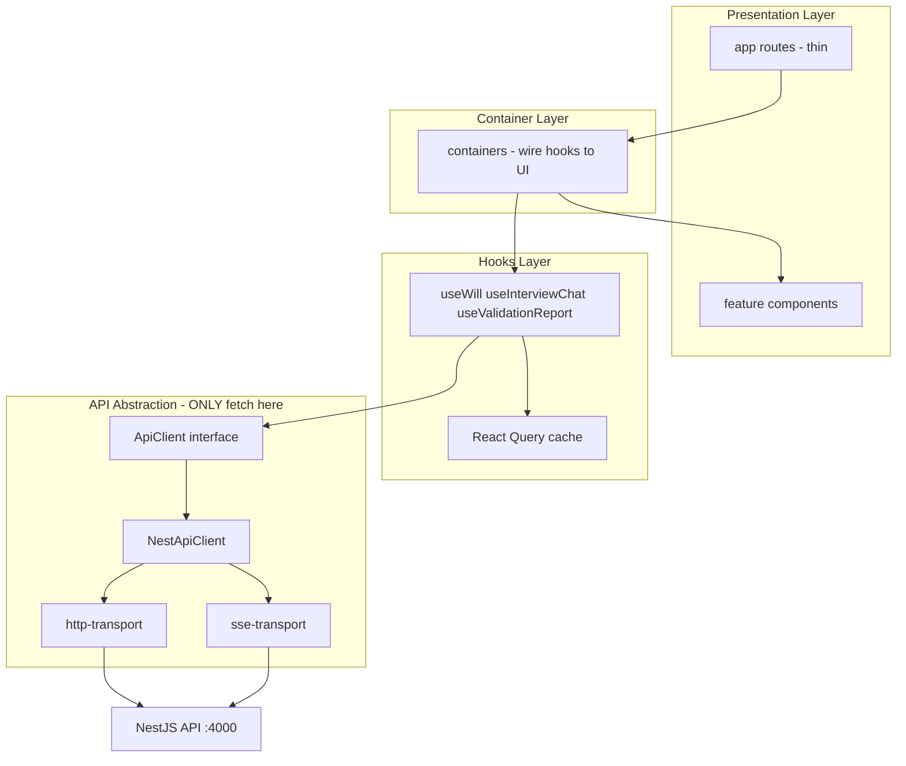

# Frontend Architecture

## Stack

- Next.js 15 (App Router)
- TanStack Query v5
- Tailwind CSS
- TypeScript strict

## Layer diagram

## Feature modules

| Feature | Container | Key hook |
|---------|-----------|----------|
| auth | LoginContainer, RegisterContainer | useLogin, useAuth |
| will-builder | DashboardContainer, WillBuilderContainer | useWill, useCreateWill |
| chat | ChatContainer | useInterviewChat |
| preview | PreviewContainer | useWillPreview |
| validation | ValidationContainer | useValidationReport |

## Chat → Preview pipeline

1. User sends message in `ChatPresentation`
2. `useInterviewChat` calls `api.interview.streamMessage` (SSE via `sse-transport.ts`)
3. On `done`: `api.interview.sync(willId)` persists facts to Will aggregate
4. `queryClient.invalidateQueries` for `will`, `preview`, `validation`
5. `PreviewContainer` refetches and re-renders sections or HTML

## Rule: no fetch in UI

All HTTP/SSE goes through `NestApiClient`. Feature code uses `useApiClient()` only.
