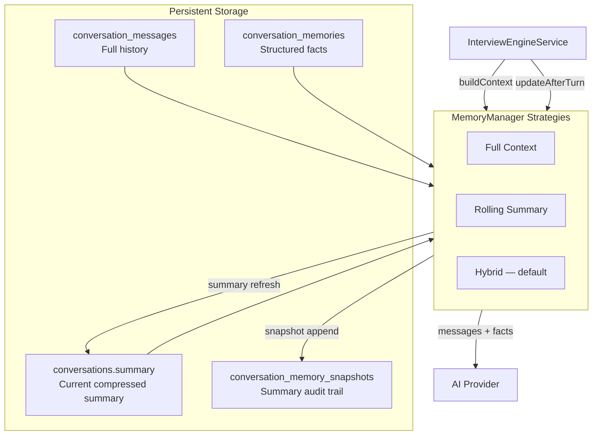

# Memory Subsystem

Long AI interviews accumulate hundreds of messages. Sending the full transcript on every turn wastes tokens, increases latency, and raises cost. The memory subsystem builds a **bounded context window** per turn while preserving authoritative structured facts.

## Architecture



### Three memory layers

| Layer | Table / field | Sent to AI? | Purpose |
|-------|---------------|-------------|---------|
| **Conversation history** | `conversation_messages` | Strategy-dependent | Raw dialogue; always persisted, not always sent |
| **Structured facts** | `conversation_memories` | **Always (full)** | Ground truth extracted from dialogue |
| **Compressed summary** | `conversations.summary` + `conversation_memory_snapshots` | When compressed | Dialogue compression for older turns |

Facts are never summarized away. Summaries only compress **dialogue**; the system prompt always includes the full fact snapshot and labels it authoritative.

## MemoryManager interface

```typescript
interface MemoryManager {
  readonly strategyName: 'full' | 'summary' | 'hybrid';
  buildContext(input: MemoryBuildInput): MemoryContext;
  updateAfterTurn(input: MemoryUpdateInput): Promise<MemoryUpdateResult>;
}
```

- **`buildContext`** — assembles the messages array sent to the model (system prompt + dialogue subset).
- **`updateAfterTurn`** — optionally refreshes the rolling summary and signals snapshot persistence.

`MemoryContext` exposes `buildMode` (`full` | `compressed`) and `estimatedTokens` for observability in SSE `done` events and `GET /interview/status`.

## Strategies

### 1. Full Context (`MEMORY_STRATEGY=full`)

Sends every message + full fact snapshot every turn.

| Pros | Cons |
|------|------|
| Zero summary loss | Token cost grows **O(turns)** |
| Lowest hallucination risk from compression | Latency increases with conversation length |
| No extra AI call for summarization | Hits context limits on very long interviews |

**Best for:** debugging, short interviews (&lt;15 turns), or when cost is not a concern.

### 2. Rolling Summary (`MEMORY_STRATEGY=summary`)

Always sends: **summary + last N messages + full facts**. Never sends full history.

| Pros | Cons |
|------|------|
| Bounded token cost (~constant per turn) | Summary may drop nuance from early turns |
| Predictable latency | Extra AI call each refresh cycle |
| Scales to long interviews | Higher hallucination risk if facts are not yet extracted |

**Best for:** known-long interviews from turn 1, or strict token budgets.

### 3. Hybrid — **recommended default** (`MEMORY_STRATEGY=hybrid`)

- **Short phase** (≤ `MEMORY_FULL_CONTEXT_THRESHOLD` messages): full history + full facts.
- **Long phase**: rolling summary + last `MEMORY_RECENT_MESSAGE_COUNT` messages + full facts.
- Summary refreshes every `MEMORY_SUMMARY_REFRESH_INTERVAL` messages after crossing the threshold.

| Pros | Cons |
|------|------|
| Early turns get full fidelity (cheap when short) | Two behavioural modes to reason about |
| Automatic compression when conversations grow | Occasional summary refresh adds latency |
| Facts always authoritative | Summary refresh is an extra AI call |

**Best for:** production — balances fidelity, cost, and latency.

## Token costs

Rough estimate: `estimatedTokens ≈ total_chars / MEMORY_CHARS_PER_TOKEN` (default 4 chars/token).

| Strategy | Input tokens per turn (approx.) | Extra calls |
|----------|----------------------------------|-------------|
| **Full** | `system + all_messages + all_facts` — grows linearly | None |
| **Summary** | `system + summary + N_recent + all_facts` — ~constant | 1 summary call per refresh |
| **Hybrid (short)** | Same as Full | None |
| **Hybrid (long)** | Same as Summary | 1 summary call every `MEMORY_SUMMARY_REFRESH_INTERVAL` turns |

**Example** (20-turn interview, ~200 tokens/message, 15 facts):

- **Full:** ~4,000+ dialogue tokens + facts every turn → high cumulative cost.
- **Hybrid:** turns 1–12 full (~2,400 tokens); turns 13+ compressed (~800 dialogue + ~300 summary) + facts.

Structured facts add tokens but are required for will accuracy; they are typically smaller than full dialogue.

## Latency tradeoffs

| Operation | Full | Summary | Hybrid |
|-----------|------|---------|--------|
| **Per-turn AI call** | Slower as history grows (more tokens to process) | Stable | Stable after threshold |
| **Summary refresh** | None | Every qualifying turn | Every N turns after threshold |
| **Typical extra latency** | 0 ms | +500–2000 ms on refresh turns | +500–2000 ms on refresh turns only |

Summary refresh uses a separate `complete()` call (`RollingSummaryService`) with `temperature: 0.2` and a fact-preservation prompt. Refresh turns are slightly slower but most turns in hybrid mode avoid that cost.

## Hallucination risks

| Risk | Mitigation in this system |
|------|---------------------------|
| **Summary drops or distorts facts** | Full fact snapshot always sent; system prompt marks facts as authoritative over summary |
| **Model invents details not in dialogue** | Facts persisted per turn via extraction; corrections routed to `CorrectionExtractionStrategy` |
| **Stale summary after user correction** | Recent N messages always included in compressed mode; corrections update `conversation_memories` immediately |
| **Conflicting summary vs facts** | Prompt explicitly says: prefer structured facts if conflict |

**Risk ranking (lowest → highest):** Full Context &lt; Hybrid &lt; Rolling Summary.

Hybrid is recommended because early turns (when users establish core facts) use full context, and later turns rely on extracted facts rather than summary alone.

## Configuration

```env
MEMORY_STRATEGY=hybrid
MEMORY_RECENT_MESSAGE_COUNT=6
MEMORY_FULL_CONTEXT_THRESHOLD=12
MEMORY_SUMMARY_REFRESH_INTERVAL=4
MEMORY_CHARS_PER_TOKEN=4
```

## File map

```
apps/api/src/application/interview/ports/
  memory-manager.port.ts          # MemoryManager interface
  memory-snapshot.repository.port.ts

apps/api/src/infrastructure/interview/memory/
  full-context.strategy.ts        # Full Context Strategy
  rolling-summary.strategy.ts     # Rolling Summary Strategy
  hybrid-memory.strategy.ts       # Hybrid Strategy (default)
  rolling-summary.service.ts      # AI-powered compression
  memory-manager.factory.ts       # Strategy selection
  memory-config.ts
  memory-strategy.utils.ts

apps/api/src/infrastructure/persistence/repositories/
  postgres-memory-snapshot.repository.ts
```

## Observability

Each interview turn SSE `done` event includes:

```json
{
  "memory": {
    "strategy": "hybrid",
    "buildMode": "compressed",
    "estimatedTokens": 1240,
    "messageCount": 18,
    "factCount": 9,
    "hasSummary": true
  }
}
```

`GET /wills/:willId/interview/status` adds `summary` and `latestSnapshotAt` for debugging compression state.
