# Sequence Diagrams — AI Assisted Will Maker

Detailed interaction flows across layers. All use cases respect the dependency rule: **Presentation → Application → Domain → Ports ← Infrastructure**.

---

## 1. User Registration & Authentication

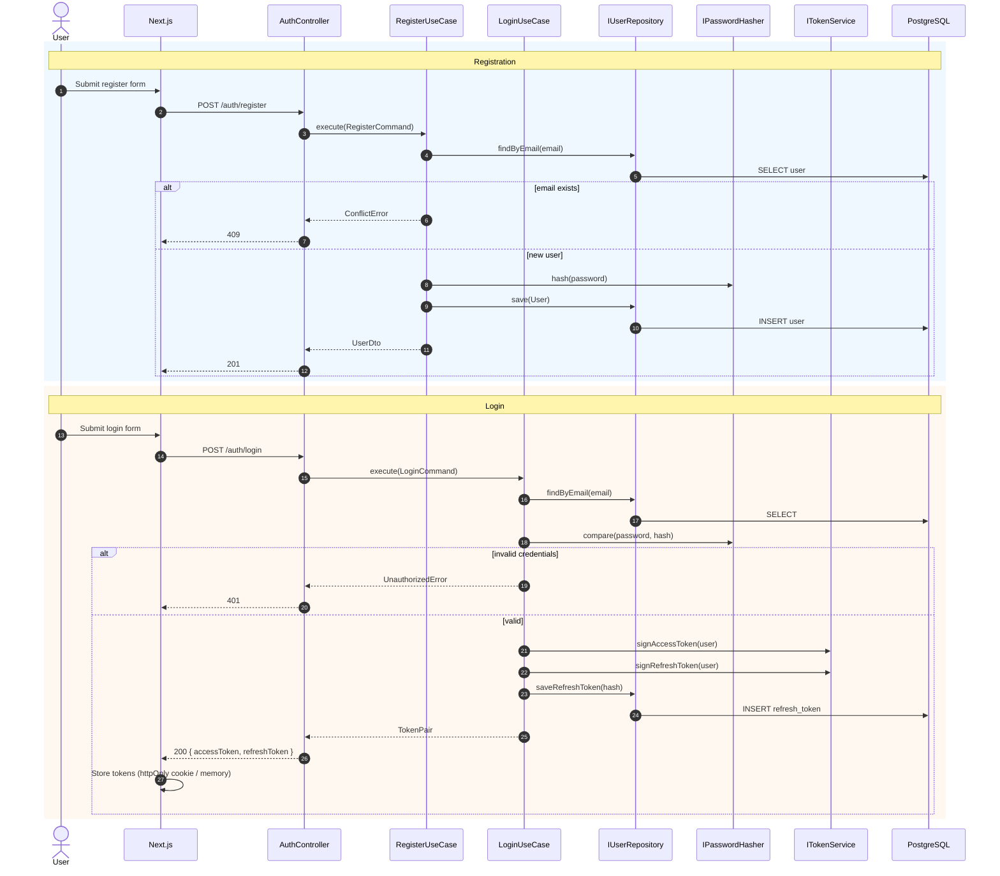

---

## 2. Create Will (Aggregate Initialization)

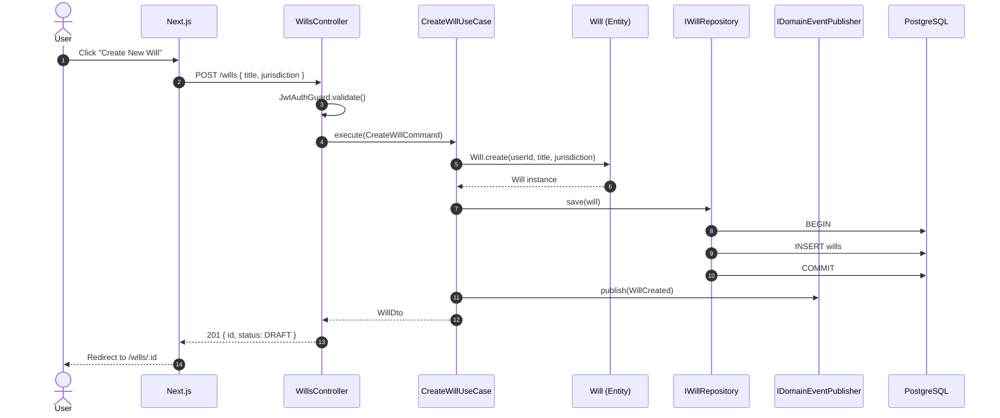

---

## 3. AI-Assisted Interview (Streaming)

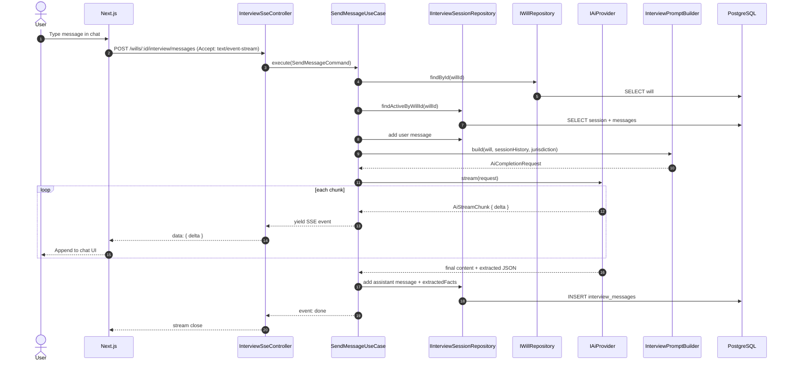

### 3.1 AI Provider Selection (Strategy)

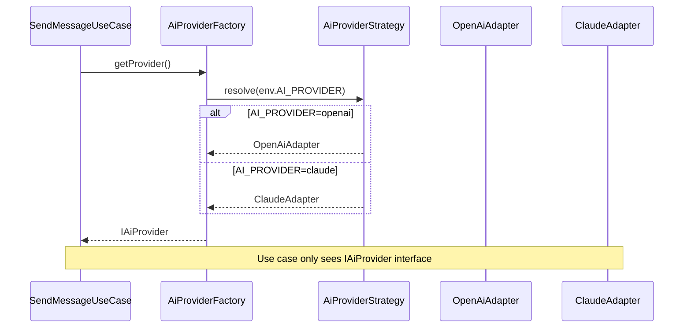

---

## 4. Sync Interview Facts → Will Aggregate

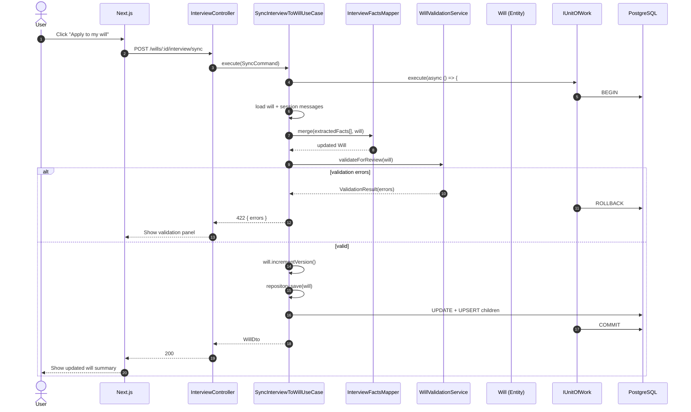

---

## 5. Finalize Will & Create Version Snapshot

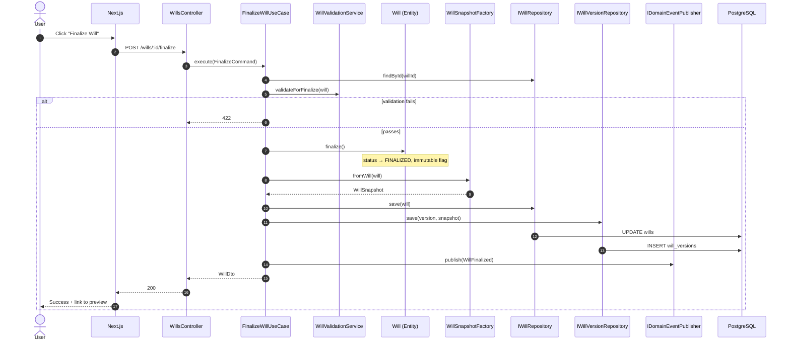

---

## 6. PDF Generation (Adapter + Strategy)

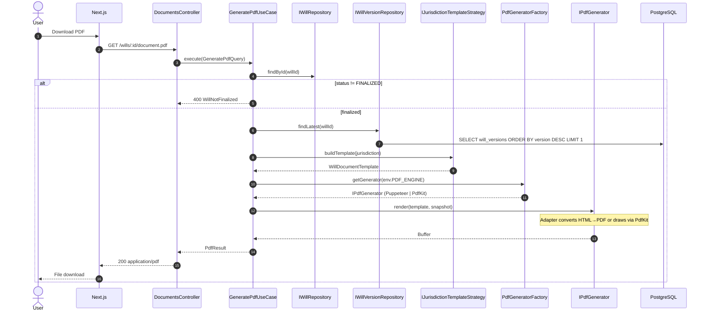

---

## 7. Manual Will Update (Non-AI Path)

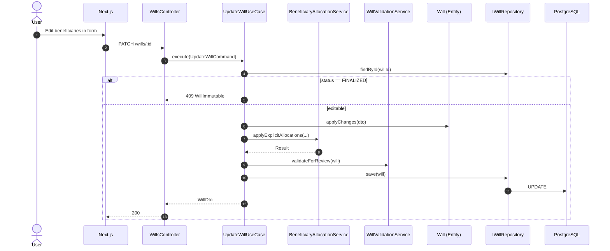

---

## 8. Docker Container Startup

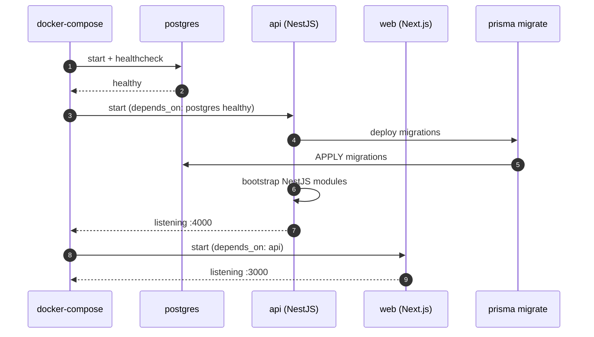

---

## 9. Error Handling Flow

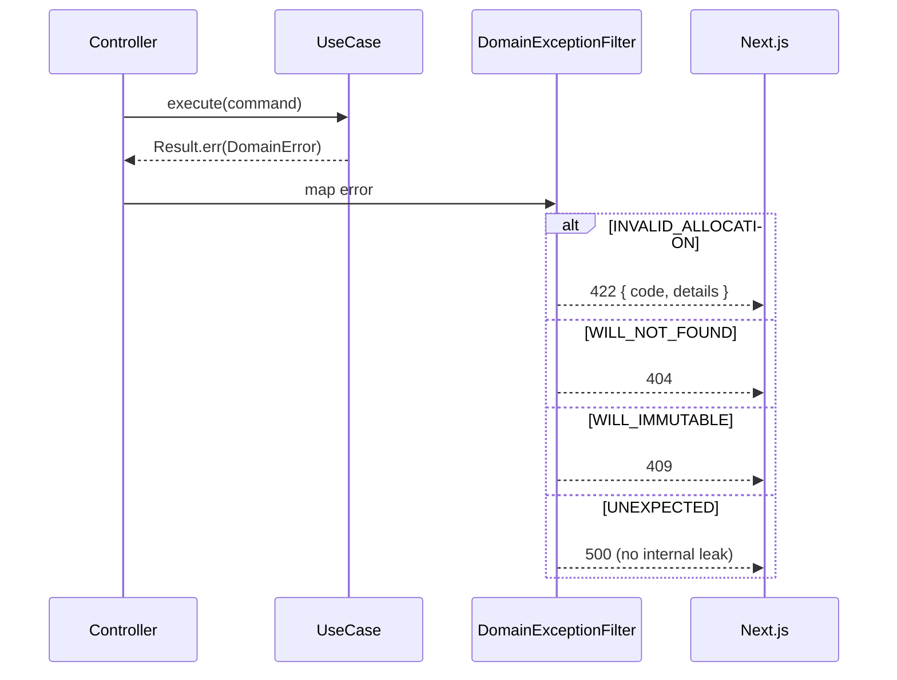

---

## 10. Cross-Cutting: Audit Log (Infrastructure)

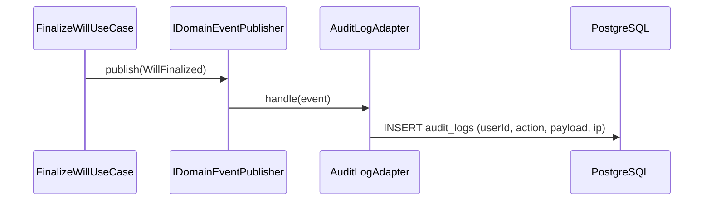

---

*Document version: 1.0*
